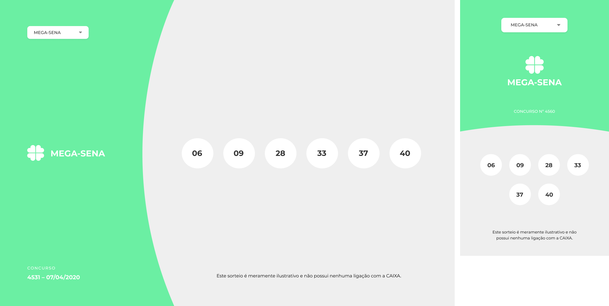

# LottoHub 🍀

Bem-vindo ao projeto **LottoHub**! Prepare-se para mergulhar no universo emocionante das loterias, trazendo toda a emoção dos números sorteados direto para o seu navegador.

## Status do Projeto  

`MVP: finalizado`

## Sobre o Projeto

Você já se perguntou como seria incrível ter uma aplicação web que traz os resultados dos sorteios das principais loterias do Brasil em um só lugar? Este projeto vai além da diversão e te convida a construir uma aplicação interativa e responsiva que oferece uma experiência única aos usuários.

## Deploy  

Acesse o projeto em: [LottoHub](https://lottohub.vercel.app/)  

## Requisitos & Funcionalidades

Este projeto desafia você a criar uma aplicação front-end que:

- Suporta 6 sorteios populares: Mega-sena, Quina, Lotofácil, Lotomania, Timemania e Dia de sorte.
- Oferece um combo-box/select intuitivo para mudar entre os diferentes sorteios.
- Atualiza dinamicamente o tema, número do sorteio, data e os números sorteados conforme a seleção.
- Garante uma experiência responsiva, ajustando-se perfeitamente a celulares e outros dispositivos.
- Utiliza a [Loterias Caixa API](https://loteriascaixa-api.herokuapp.com/api) para buscar os resultados dos sorteios.

## Como Começar

1. Clone este repositório para a sua máquina local.
2. Instale as dependências necessárias com `npm install` ou `yarn install`.
3. Inicie o servidor de desenvolvimento com `npm start` ou `yarn start`.
4. Navegue até o endereço indicado para ver a aplicação em ação.

## Layout Responsivo

Segui o design disponibilizado no [Figma](https://www.figma.com/file/H2qrYBCFMf4didYmxRwTxP/Brainn-Frontend-Challenge), porém realizei alguns ajustes.  

## Contribuindo

Sinta-se à vontade para contribuir com melhorias, correções de bugs ou novas funcionalidades. Basta seguir os passos:

1. Faça um fork deste repositório.
2. Crie uma branch com sua feature: `git checkout -b minha-feature`.
3. Commit suas mudanças: `git commit -m 'Minha nova feature'`.
4. Push para a branch: `git push origin minha-feature`.

## Licença

Todos os direitos reservados à Brainn e toda a equipe idealizadora desse desafio, além da equipe desenvolvedora da API utilizada!

## Contato

Tem alguma dúvida, sugestão ou apenas quer compartilhar sua experiência com o projeto? Entre em contato comigo em [odevicaroteles@gmail.com](mailto:odevicaroteles@gmail.com).

Divirta-se construindo e explorando os resultados das loterias!

Feito por Ícaro Teles

[Acessar Repositório do Desafio Original](https://github.com/brainnco-exs/readme-frontend.git)
